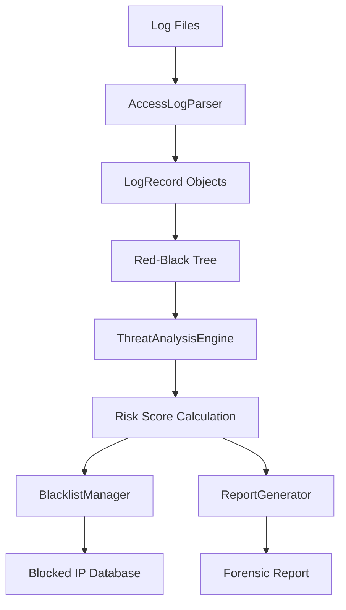

```mermaid
graph TD
    A[Log Files] --> B[AccessLogParser]
    B --> C[LogRecord Objects]
    C --> D[Red-Black Tree]
    D --> E[ThreatAnalysisEngine]
    E --> F[Risk Score Calculation]
    F --> G[BlacklistManager]
    F --> H[ReportGenerator]
    G --> I[Blocked IP Database]
    H --> J[Forensic Report]
```
