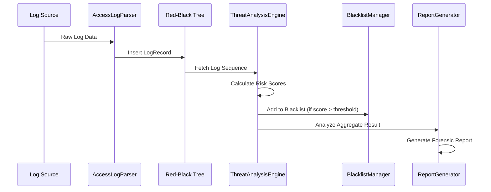

```mermaid
sequenceDiagram
    participant LS as Log Source
    participant AP as AccessLogParser
    participant RBT as Red-Black Tree
    participant TE as ThreatAnalysisEngine
    participant BM as BlacklistManager
    participant RG as ReportGenerator

    LS->>AP: Raw Log Data
    AP->>RBT: Insert LogRecord
    RBT->>TE: Fetch Log Sequence
    TE->>TE: Calculate Risk Scores
    TE->>BM: Add to Blacklist (if score > threshold)
    TE->>RG: Analyze Aggregate Result
    RG->>RG: Generate Forensic Report
```
